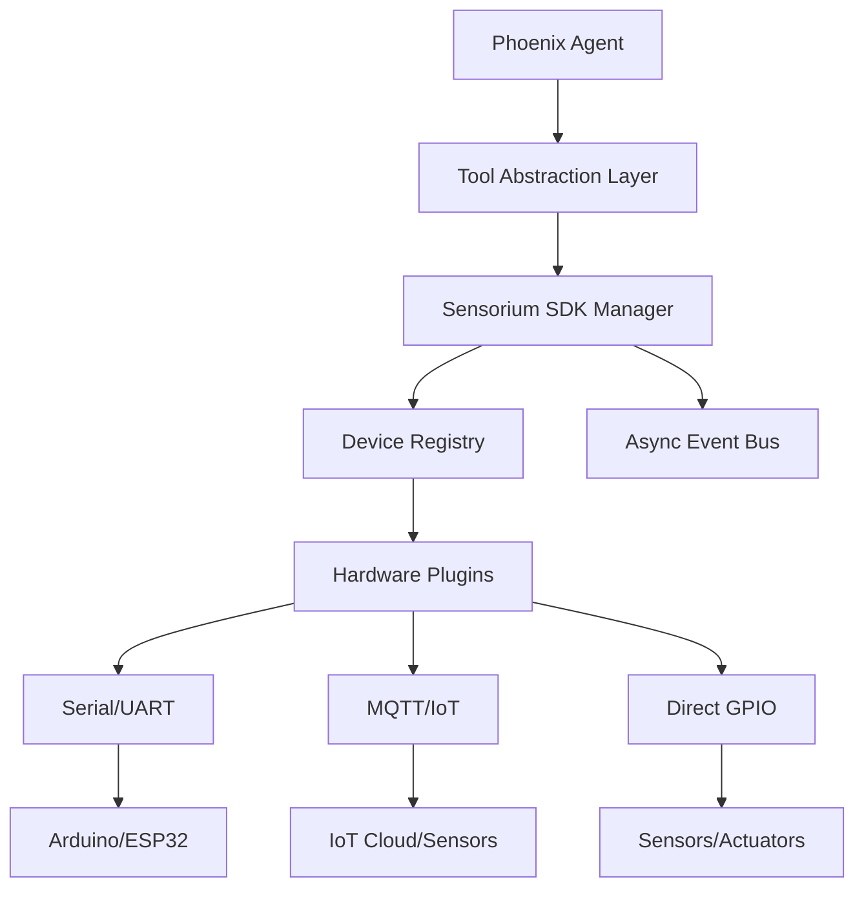

# Phoenix-AI Sensorium Hardware SDK

The **Sensorium SDK** transforms Phoenix-AI from a software-only agent framework into a physical **AI Operating System**. It allows agents to perceive the world through sensors and interact with it via actuators.

## Core Concepts

- **Sensorium**: The sensory and motor subsystem of the Phoenix Agent.
- **Plugins**: Dynamic drivers for hardware (Cameras, Radar, Arduino, etc.).
- **Protocols**: Standardized communication (Serial, MQTT, WebSocket).
- **Perception Layer**: Converts raw sensor data into semantic concepts the Agent can understand.

---

## Real-World Scenarios

### 1. Sky-Guard: Drone Detection System
In this scenario, a Phoenix Agent monitors the airspace for unauthorized drones.

**Hardware Stack:**
- **Radar Plugin**: Scans for moving objects.
- **High-Res Camera**: Captures frames for visual verification.
- **Siren Actuator**: Connected via GPIO.

**Workflow:**
1. The **Radar Plugin** detects an object and emits a `motion_detected` event.
2. The **Event Bus** notifies the Agent.
3. The Agent uses the `camera.capture()` tool to get a frame.
4. The **Perception Layer** (YOLO/VLM) identifies the object as a "Drone".
5. The Agent decides to trigger the `siren.alarm()` tool and reports to the "Army sides" via the API.

```python
# Example Agent Interaction
await agent.run("If you detect a drone via radar, take a photo and sound the alarm.")
```

### 2. Smart Home "Butler" Agent
An embodied agent that manages home comfort and security.

### 3. Industrial Quality Control Robot
A robot arm that inspects parts on a conveyor belt.

---

## Implementing Real Hardware

To add a new device, inherit from `DevicePlugin` and implement the `connect`, `disconnect`, `read`, and `write` methods using one of the built-in protocols.

### Example 1: Arduino Sensor (Serial)
Perfect for sensors connected via USB to your Raspberry Pi or PC.

```python
from phoenix.framework.sensorium.plugins.base import DevicePlugin
from phoenix.framework.sensorium.protocols.serial_protocol import SerialProtocol
from phoenix.framework.sensorium.core.models import SensorData
from phoenix.framework.sensorium.core.capabilities import DeviceCapability

class ArduinoSensor(DevicePlugin):
    def __init__(self, port="/dev/ttyUSB0"):
        # Protocol handles the low-level threading and IO
        protocol = SerialProtocol(port=port, baudrate=9600)
        super().__init__("arduino_01", metadata, [DeviceCapability.READ], protocol)

    async def read(self):
        # Read a line like "25.4" from Arduino
        line = await self.protocol.receive()
        if line:
            return SensorData(self.device_id, "temperature", float(line), "C")
        return None
```

### Example 2: IoT Power Plug (MQTT)
Ideal for distributed devices connected over Wi-Fi.

```python
from phoenix.framework.sensorium.plugins.base import DevicePlugin
from phoenix.framework.sensorium.protocols.mqtt_protocol import MQTTProtocol
from phoenix.framework.sensorium.core.capabilities import DeviceCapability

class SmartPlug(DevicePlugin):
    def __init__(self, broker_ip="192.168.1.50"):
        protocol = MQTTProtocol(broker=broker_ip)
        super().__init__("plug_01", metadata, [DeviceCapability.WRITE], protocol)

    async def write(self, command: str):
        # command could be "ON" or "OFF"
        return await self.protocol.send("home/living_room/plug/set", command)
```

### Example 3: USB Camera (OpenCV)
For high-speed vision processing without a specialized protocol.

```python
import cv2
from phoenix.framework.sensorium.plugins.base import DevicePlugin

class USBWebcam(DevicePlugin):
    async def connect(self):
        self.cap = cv2.VideoCapture(0)
        return self.cap.isOpened()

    async def read(self):
        ret, frame = self.cap.read()
        return {"success": ret, "frame": frame}

    async def disconnect(self):
        self.cap.release()
        return True
```

---

## Technical Architecture



## Getting Started

### 1. Initialize the Manager
```python
from phoenix.framework.sensorium.core.manager import DeviceManager
manager = DeviceManager()
```

### 2. Add a Device
```python
from phoenix.framework.sensorium.plugins.mock_plugin import MockSensorPlugin
await manager.add_device("thermometer", MockSensorPlugin())
```

### 3. Let the Agent Use It
```python
from phoenix.framework.agent.tools.base import tool

@tool(name="check_temp", description="Reads temperature")
async def check_temp():
    device = manager.get_device("thermometer")
    return await device.read()

agent.register_tool(check_temp)
await agent.run("What is the temperature?")
```

## Performance Optimization
Sensorium is built for **Edge AI** (Raspberry Pi/Jetson Nano):
- **Async-First**: Never blocks the Agent's reasoning loop.
- **Zero-Lag Streaming**: Uses a frame-dropping buffer for video to ensure real-time response.
- **Memory Efficient**: Uses Python `__slots__` to handle thousands of events per second.
