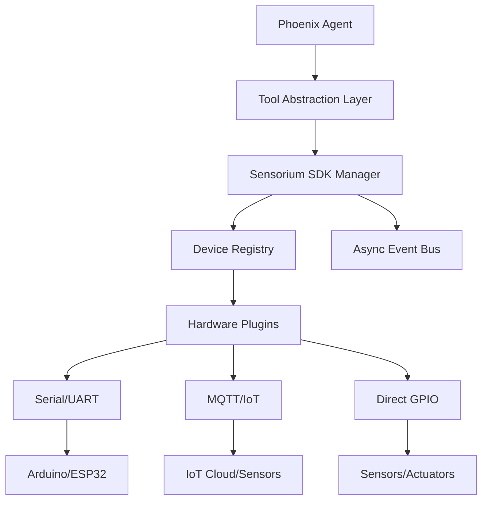

# Phoenix-AI Sensorium Hardware SDK

The **Sensorium SDK** transforms Phoenix-AI from a software-only agent framework into a physical **AI Operating System**. It allows agents to perceive the world through sensors and interact with it via actuators.

## Core Concepts

- **Sensorium**: The sensory and motor subsystem of the Phoenix Agent.
- **Plugins**: Dynamic drivers for hardware (Cameras, Radar, Arduino, etc.).
- **Protocols**: Standardized communication (Serial, MQTT, WebSocket).
- **Perception Layer**: Converts raw sensor data into semantic concepts the Agent can understand.

---

## Real-World Scenarios

### 1. Sky-Guard: Drone Detection System
In this scenario, a Phoenix Agent monitors the airspace for unauthorized drones.

**Hardware Stack:**
- **Radar Plugin**: Scans for moving objects.
- **High-Res Camera**: Captures frames for visual verification.
- **Siren Actuator**: Connected via GPIO.

**Workflow:**
1. The **Radar Plugin** detects an object and emits a `motion_detected` event.
2. The **Event Bus** notifies the Agent.
3. The Agent uses the `camera.capture()` tool to get a frame.
4. The **Perception Layer** (YOLO/VLM) identifies the object as a "Drone".
5. The Agent decides to trigger the `siren.alarm()` tool and reports to the "Army sides" via the API.

```python
# Example Agent Interaction
await agent.run("If you detect a drone via radar, take a photo and sound the alarm.")
```

### 2. Smart Home "Butler" Agent
An embodied agent that manages home comfort and security.

**Hardware Stack:**
- **Temperature/Humidity Sensors**: Connected via MQTT.
- **Smart Blinds**: Connected via Serial/ESP32.
- **Motion Sensors**: Connected via Zigbee/MQTT bridge.

**Workflow:**
1. The Agent receives a query: "It's too hot in here."
2. The Agent uses `sensor.read_temperature()` to verify (Result: 28°C).
3. The Agent looks for a solution: `blinds.close()`.
4. The Agent confirms: "I've closed the blinds to cool down the room."

### 3. Industrial Quality Control Robot
A robot arm that inspects parts on a conveyor belt.

**Hardware Stack:**
- **Conveyor Motor**: Controlled via Serial.
- **Proximity Sensor**: Connected via GPIO.
- **Inspection Camera**: High-speed stream via WebSockets.

**Workflow:**
1. The **Proximity Sensor** triggers an event when a part arrives.
2. The Agent stops the conveyor: `motor.stop()`.
3. The Agent inspects the part: `camera.inspect()`.
4. If "Defective", it triggers a sorter arm: `actuator.push_rejected()`.
5. Restart conveyor: `motor.start()`.

---

## Technical Architecture



## Getting Started

### 1. Initialize the Manager
```python
from phoenix.framework.sensorium.core.manager import DeviceManager
manager = DeviceManager()
```

### 2. Add a Device
```python
from phoenix.framework.sensorium.plugins.mock_plugin import MockSensorPlugin
await manager.add_device("thermometer", MockSensorPlugin())
```

### 3. Let the Agent Use It
```python
from phoenix.framework.agent.tools.base import tool

@tool(name="check_temp", description="Reads temperature")
async def check_temp():
    return await manager.get_device("thermometer").read()

agent.register_tool(check_temp)
await agent.run("What is the temperature?")
```

## Performance Optimization
Sensorium is built for **Edge AI** (Raspberry Pi/Jetson Nano):
- **Async-First**: Never blocks the Agent's reasoning loop.
- **Zero-Lag Streaming**: Uses a frame-dropping buffer for video to ensure real-time response.
- **Memory Efficient**: Uses Python `__slots__` to handle thousands of events per second.
