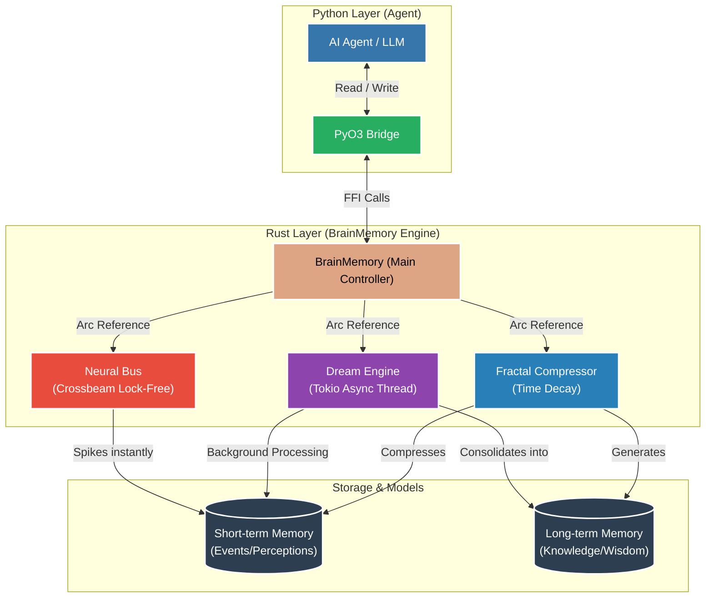
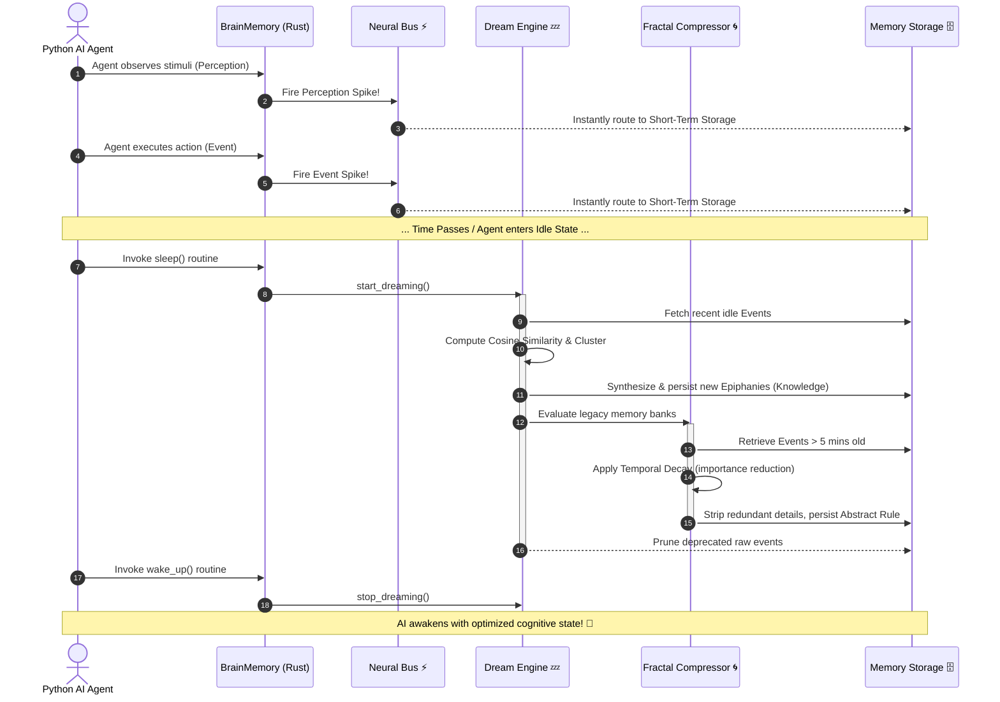

# BrainMemory Engine Architecture

This document outlines the architectural design of the **BrainMemory** system, an advanced memory engine developed in Rust and integrated with Python via PyO3. The primary objective of this engine is to transform static database-driven memory into a "living brain" that interacts in real-time, processes thoughts in the background, and distills wisdom over time.

---

## Core Components

1. **Neural Spiking Event Bus:**
   - Functions as an ultra-fast, lock-free conduit for ingesting events and perceptions instantaneously.
   - Utilizes `crossbeam` to instantiate a dedicated background thread that continuously listens for and routes memory spikes without blocking the main AI execution loop.

2. **Subconscious Dream Engine:**
   - An asynchronous processing environment built on the `Tokio` runtime.
   - Activates when the AI agent enters a "sleep" or idle state. It correlates past events, calculates semantic similarities, and extracts new patterns to synthesize high-level cognitive nodes (`Knowledge`).

3. **Fractal Compressor:**
   - An intelligent time-series decay algorithm.
   - Compresses aging events that have lost their granular relevance, transforming them into "Abstract Rules". This preserves the core lessons learned while significantly reducing data bloat.

---

## 1. High-Level Architecture

The following diagram illustrates the interaction between the Python environment (AI Agent) and the Rust backend (Memory Engine).

---

## 2. Memory Lifecycle & Workflows

The following sequence details how an event transitions from immediate occurrence to consolidated wisdom over time.

---

## Architectural Advantages

1. **Zero Bottlenecks (High Throughput):** Leveraging `Crossbeam`, the Python Agent is never blocked by memory I/O operations. Memory spikes are offloaded and persisted asynchronously in a dedicated background thread.
2. **Idle Time Utilization:** The AI conserves computational resources (Tokens/CPU) during active execution. It capitalizes on idle states to run the `Dream Engine` in the background, consolidating its experiences without impacting latency.
3. **No Memory Bloating:** Traditional AI agents suffer from context degradation as memory scales. The `Fractal Compressor` mitigates this by aggressively compressing context into immutable rules, optimizing storage footprint and ensuring retrieval latency remains sub-millisecond.
